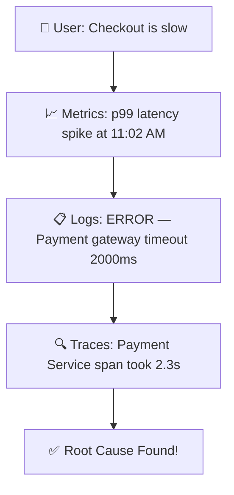

# 🔭 Observability: A Complete Overview

## What is Observability?

Observability is the ability to understand the **internal state of a system** by examining its external outputs.
In software and infrastructure, it means you can answer the question:
> *"Why is my system behaving this way?"* — just by looking at the data it produces.

It goes beyond simple monitoring (which tells you *what* is broken) by helping you understand *why* something broke, even if you've never seen that failure before.

---

## 🏛️ The Three Pillars of Observability

---

### 1. 📋 Logs

#### What are Logs?
Logs are **timestamped, immutable records** of discrete events that happen within a system.
Think of them as your application's diary — every event, error, warning, or action is written down with a timestamp.

**Examples:**
- `[2026-03-31 11:00:01] ERROR: Database connection failed on port 5432`
- `[2026-03-31 11:00:02] INFO: User "john_doe" logged in successfully`
- `[2026-03-31 11:00:03] WARN: Memory usage exceeded 80%`

#### Purpose
- Debug errors and exceptions
- Audit user actions and system events
- Reconstruct the sequence of events leading to a failure
- Compliance and security forensics

---

#### 🛠️ Tools for Logs

| Feature | **Datadog (Paid)** | **ELK Stack / Elasticsearch (Free)** |
|---|---|---|
| Type | SaaS, fully managed | Self-hosted, open-source |
| Setup | Minutes | Hours to days |
| Scalability | Auto-scales | Manual scaling required |
| Alerting | Built-in, smart alerts | Manual configuration |
| Cost | Paid per GB ingested | Free (but infra cost) |

##### ✅ Advantage of Datadog over ELK Stack
- **Zero infrastructure management** — no need to manage Elasticsearch nodes, Logstash pipelines, or Kibana servers.
- **Automatic log parsing and pattern detection** using ML — ELK requires manual Grok parsers.
- **Unified platform** — logs, metrics, and traces are correlated in one place natively, whereas ELK needs extra plugins (like APM) to achieve this.
- **Built-in anomaly detection** — ELK requires manual threshold tuning.

---

### 2. 📈 Metrics

#### What are Metrics?
Metrics are **numerical measurements collected over time**, representing the state or performance of a system.
They are aggregated data points (unlike logs which are individual events).

**Examples:**
- CPU usage: `85%` at `11:00:00`
- HTTP request rate: `1500 requests/second`
- Error rate: `0.5%` over last 5 minutes
- Database query latency: `p99 = 340ms`

#### Purpose
- Track system health at a glance
- Trigger alerts when thresholds are breached
- Capacity planning and trend analysis
- SLA/SLO monitoring (e.g., uptime > 99.9%)

---

#### 🛠️ Tools for Metrics

| Feature | **New Relic (Paid)** | **Prometheus (Free)** |
|---|---|---|
| Type | SaaS, fully managed | Self-hosted, open-source |
| Data Retention | Long-term, configurable | Default 15 days (local) |
| Dashboards | Built-in, drag-and-drop | Requires Grafana setup |
| Alerting | Smart, ML-based | Basic threshold alerts |
| Cardinality Handling | Excellent | Struggles at very high cardinality |

##### ✅ Advantage of New Relic over Prometheus
- **Long-term data retention** out of the box — Prometheus stores data locally with a default 15-day limit; extending it requires extra infrastructure like Thanos or Cortex.
- **No need to manage a separate visualization tool** — Prometheus alone has no dashboards and must be paired with Grafana, while New Relic has everything built in.
- **ML-powered anomaly detection** — New Relic can automatically detect unusual spikes without manually setting thresholds, which Prometheus cannot do natively.
- **Cross-signal correlation** — New Relic links metrics directly to logs and traces; Prometheus is metrics-only.

---

### 3. 🔍 Traces

#### What are Traces?
Traces track the **journey of a single request** as it travels through multiple services, components, or microservices.
A trace is made up of multiple **spans**, where each span represents one unit of work.

**Examples:**
- A user places an order → the request hits the API Gateway → Auth Service → Order Service → Payment Service → Database. A trace shows the time spent in each step.
- Span 1: `API Gateway` → 5ms
- Span 2: `Auth Service` → 12ms
- Span 3: `Payment Service` → 340ms ← 🚨 bottleneck identified!

#### Purpose
- Identify performance bottlenecks in distributed systems
- Understand dependencies between microservices
- Debug latency issues across service boundaries
- Root cause analysis in complex architectures

---

#### 🛠️ Tools for Traces

| Feature | **Dynatrace (Paid)** | **Jaeger (Free)** |
|---|---|---|
| Type | SaaS, fully managed | Self-hosted, open-source |
| Auto-instrumentation | Yes, automatic (OneAgent) | Manual SDK instrumentation |
| AI Root Cause Analysis | Yes (Davis AI) | No |
| Service Topology Map | Auto-generated | Basic dependency graph |
| Setup Complexity | Low | High |

##### ✅ Advantage of Dynatrace over Jaeger
- **Zero-code auto-instrumentation** via the OneAgent — Dynatrace automatically instruments your application without code changes. Jaeger requires you to manually add SDK calls throughout your codebase.
- **Davis AI for root cause analysis** — Dynatrace's AI engine automatically pinpoints the root cause of a problem across traces, logs, and metrics together. Jaeger only shows you trace data; you must manually analyze it.
- **Automatic service topology mapping** — Dynatrace generates a real-time map of all your services and their dependencies automatically. Jaeger shows basic trace graphs but does not generate a living dependency map.
- **Full-stack correlation** — Dynatrace links a slow trace all the way down to the underlying host CPU spike, database query, and log error automatically.

---

## 🔗 How the Three Pillars Work Together

The real power of observability comes when all three pillars are **correlated**:

Without all three pillars together, you'd only see part of the picture.

---

## 📊 Quick Reference Summary

| Pillar  | Answers              | Free Tool     | Paid Tool   |
|---------|----------------------|---------------|-------------|
| Logs    | What happened?       | ELK Stack     | Datadog     |
| Metrics | How is the system?   | Prometheus    | New Relic   |
| Traces  | Where is it slow?    | Jaeger        | Dynatrace   |

| Pillar  | Answers              | Free Tool     | Paid Tool   |
|---------|----------------------|---------------|-------------|
| Logs    | Why is it happening? | ELK Stack     | Datadog     |
| Metrics | What's happening?    | Prometheus    | New Relic   |
| Traces  | Where's it happening?| Jaeger        | Dynatrace   |
